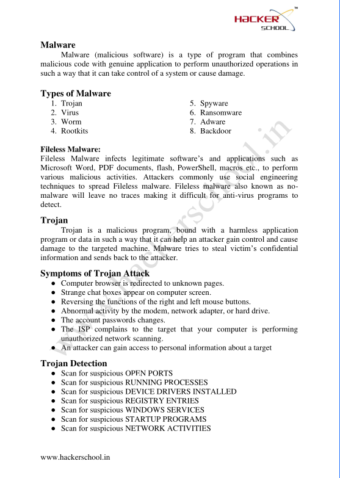
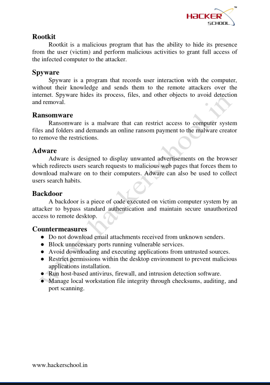
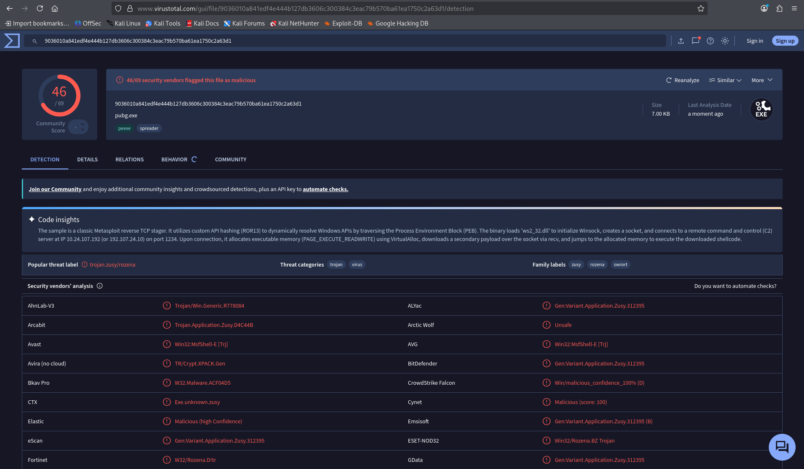
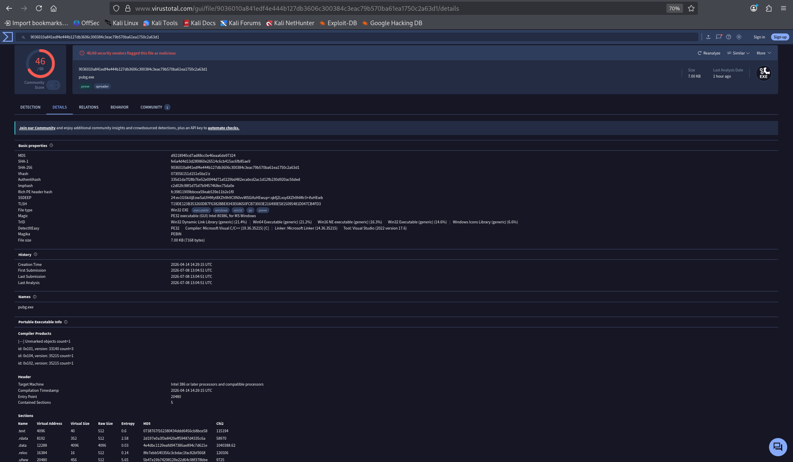
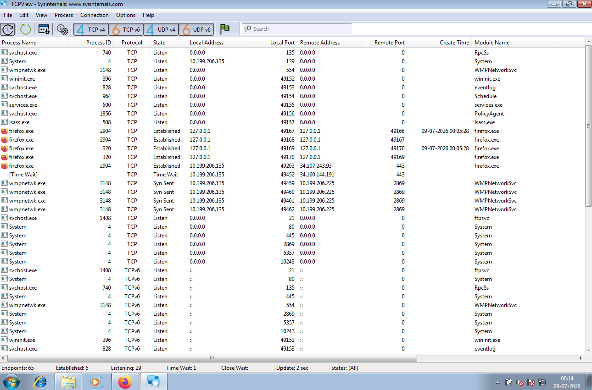
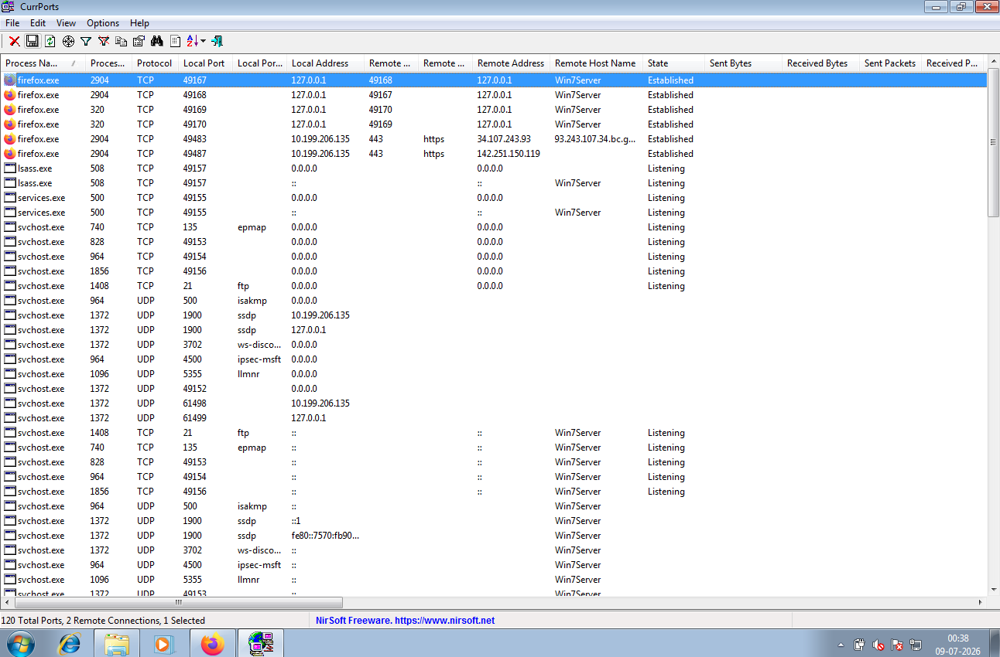
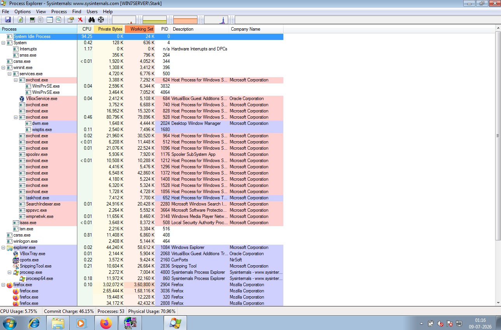

# malware-threats-and-analysis

# Part 1 – Introduction to Malware Threats

## Objective

I want to understand what malware is. I want to know about the types of malware. I want to learn how malware affects computer systems.. I want to know why malware analysis is important for people who work in cybersecurity.

---

# What is Malware?

Malware is software that is made to hurt computer systems. It can steal information. It can damage files. It can even get into a device without permission. Malware is also known as Malicious Software.

People who work in security study malware to learn about the ways attackers work. They do this to make threat detection better. They do this to make security controls stronger.

---

## 1. Understanding Malware

### What We Are Doing

We are learning about the basics of malware. We are learning why malware is a threat to cybersecurity.

### Description

Malware is made to do things to a computer system. It does this without the user knowing. It does this without the user giving permission.

If we understand malware we can identify threats. We can respond to security incidents.

### Screenshot

---

## 2. Common Types of Malware

### What We Are Doing

We are looking at the types of malware. These are the types used in cyber attacks.

### Malware Types

- Ransomware

- Adware

- Backdoor

- Ransomware

- Spyware

- Rootkit

- Bot / Botnet

### Description

Each type of malware works differently. Each type targets systems in ways.

If we know about these categories we can spot activity. We can do this when we are investigating incidents.

### Screenshot

---

## Key Concepts Learned

- Malware

- Malware Categories

- Cyber Threats

- Malware Behaviour

- Defensive Awareness

---

## conclusion

In this part I learned about malware. 
I learned what malware is. I learned why malware is used by attackers. 
I learned about the types of malware. 
I learned why understanding malware is important, for people who work in cybersecurity. 
I learned about malware. 
How it affects computer systems. 
I learned about malware. 
How it is used in cyber attacks.
## **note** I have used hackers school screenshots 

## **Reason** i have did my CEH certification in hackers school 

--------

# Part 2 – Static Malware Analysis Using VirusTotal

## Objective

I want to learn how to do static malware analysis using VirusTotal. This means I will look at a file and understand what the analysis report is telling me.

---

# What is Static Malware Analysis?

Static malware analysis is when I look at a file without running it.

This is a way for security professionals to get information about a suspicious file.

VirusTotal is a popular platform for doing this kind of analysis.

---

## 1. Access VirusTotal

### What We Are Doing

Now I will open the VirusTotal platform to look at a file.

### Description

VirusTotal uses antivirus engines to scan the files I upload.

Then it gives me a lot of information about the file like what was found the file properties and what other people think about the file.

---

## 2. Upload the File

### What We Are Doing

Next I will upload the laboratory sample file to VirusTotal for analysis.

### Description

I select the File tab and upload the sample file.

VirusTotal then looks at the file. Makes a report.

---

## 3. Review the Analysis Report

### What We Are Doing

Now I will look at the results from VirusTotal.

### Observe

- How many antivirus programs found something

- What each antivirus program found

- The name of the file

- How the file is

- The MD5 Hash

- The SHA-1 Hash

- The SHA-256 Hash

- What kind of file it is

### Description

The report from VirusTotal tells me a lot about the file.

This helps me decide if the file is bad or not.

Different antivirus programs might say things about the same file.

---

## Screenshot

---

# Key Concepts Learned

- Static Malware Analysis using VirusTotal

- VirusTotal and what it does

- Detection Ratio and how it works

- Antivirus Engines and how they help

- File Hashes and why they are important

- How to identify malware using VirusTotal

---https://www.virustotal.com

# conclusion

In this part I learned how to do malware analysis.

I learned how VirusTotal looks at files.

I learned what the detection ratio means.

I learned why file hashes are important when looking for malware.

I learned how security analysts use VirusTotal to investigate problems.

I am using VirusTotal to learn about Static Malware Analysis.

Static Malware Analysis is a skill.

VirusTotal is a tool, for Static Malware Analysis.

----------------------------------------------------------------------------------------------------------------------------------------------------------------------------------------------

# Part 3 – Interpreting the VirusTotal Analysis Report

## Objective

I want to learn how to make sense of the information in a VirusTotal analysis report. This will help me understand how security analysts use this info to investigate files.

---

# Why Analyze the Report?

Just uploading a file to VirusTotal is not enough. The real value comes from understanding the report and using it to decide if a file might be malicious.

## 1. Review the Detection Ratio

### What We Are Doing

We need to see how many antivirus engines think the uploaded file is malicious.

### Description

The detection ratio gives us an idea of how many people think the file is suspicious. If lots of antivirus engines detect it we should probably look closer.. We always need to consider more evidence before making a decision.

## 2. Examine File Properties

### What We Are Doing

Lets look at the details about the file that was uploaded.

### Observe

* File Name

* File Type

* File Size

* Analysis Date

### Description

File properties help us understand what the file is like. We can compare it to files we've seen before to help with our investigation.

## 3. Review Hash Values

### What We Are Doing

We need to find the codes that are assigned to the file.

### Observe

* MD5

* SHA-1

* SHA-256

### Description

These codes are like fingerprints, for the file. We use them to identify the file and see if its been reported before.

## 4. Review Security Vendor Results

### What We Are Doing

Lets compare what different antivirus companies think about the file.

### Description

Each company has its way of detecting malware. That's why the same file might get names from different companies.

## Screenshot

---

# Key Concepts Learned

* Detection Ratio

* File Metadata

* Cryptographic Hashes

* Antivirus Vendor Analysis

* Malware Identification

---

# conclusion

In this part I learned:

* How to understand a VirusTotal report.

* I should be careful when looking at detection ratios.

* File hashes are important when investigating.

* Different antivirus companies might classify files differently.

------------------------------------------------------------------------------------------------------------------------------------------------------------------------------

# Part 4 – Understanding Static and Dynamic Malware Analysis

## Objective

I want to understand the difference between static malware analysis and dynamic malware analysis. I want to learn how each technique helps security professionals investigate files during malware analysis.

---

# Why is Malware Analysis Important?

Malware analysis is important because it helps security professionals understand how a suspicious file behaves. It helps them identify threats and determine what security measures they need to take.

There are two approaches used during malware analysis:

- Static Analysis

- Dynamic Analysis

Both approaches provide valuable information and are often used together during malware investigations.

---

## 1. Static Malware Analysis

### What We Are Learning

Static malware analysis is the process of examining a file without running it.

### Information Collected

- File Name

- File Type

- File Size

- File Hashes like MD5, SHA-1, SHA-256

- Metadata

- Digital Signatures

- Antivirus Detection Results

### Description

Static analysis is usually the step of a malware investigation. This is because it allows analysts to safely collect information without running the file.

VirusTotal is one of the used platforms for performing basic static malware analysis.

---

## 2. Dynamic Malware Analysis

### What We Are Learning

malware analysis is the process of observing the behaviour of a suspicious file while it is running inside a controlled and isolated environment.

### Common Observations

- What processes are running

- What is happening in the file system

- What changes are made to the registry

- What network connections are made

- How the system behaves

### Description

Dynamic analysis helps security professionals understand what actions malware takes after it is run.

Because malware is run during this process dynamic analysis should only be done inside isolated laboratory or sandbox environments.

---

## 3. Static Analysis vs Dynamic Analysis

| Static Analysis Dynamic Analysis |

|-----------------|------------------|

| The file is not run | The file is run in an environment |

| It is a safe initial analysis | The behaviour is observed during execution |

| It collects hashes and metadata | It observes what happens when the file is running |

| It is an analysis | It provides insights into what the malware does |

---

# Key Concepts Learned

- Static Malware Analysis

- Dynamic Malware Analysis

- Malware Behaviour

- File Hashes

- Metadata

- Behavioural Analysis

---

# conclusion

In this part I learned about the difference between static and dynamic malware analysis. 
I learned when static analysis is preferred and when dynamic analysis is required. 
I also learned why both techniques are important, during malware investigations. 
I learned about malware analysis and dynamic malware analysis.

----------------------------------------------------------------------------------------------------------------------------------------------------------------------------

# Part 5 – Monitoring Network Connections with TCPView

## Objective

Learn how to monitor TCP and UDP network connections using TCPView. Understand how TCPView helps security professionals identify network activity during malware investigations.

## What is TCPView?

TCPView is a tool from Microsoft Sysinternals. It shows TCP and UDP connections on a Windows system in time.

TCPView helps security professionals see which processes are communicating over the network. They can check connection details. Find suspicious network activity.

## 1. Launch TCPView

### What We Are Doing

TCPView and see all active network connections.

### Description

TCPView keeps updating. Shows real-time network activity for every process.

## 2. Analyze Active Network Connections

### What We Are Doing

Look at the information for each connection.

### Observe

* Process Name

* Process ID (PID)

* Protocol (TCP / UDP)

* Local Address

* Local Port

* Remote Address

* Remote Port

* Connection State

### Description

Each row in TCPView is a network connection. By checking these details analysts can see which application is communicating over the network. They can tell if the communication seems normal or suspicious.

## 3. Investigate Connections

### What We Are Doing

Look for unusual network activity.

### Examples

* Unknown processes talking to systems.

* Unexpected external IP addresses.

* Unusual listening ports.

* Multiple outbound connections from applications.

### Description

Monitoring network connections helps analysts find malware activity. They can detect communications or suspicious processes that need more investigation.

## Screenshot

## Key Concepts Learned

* TCPView

* TCP Connections

* UDP Connections

* Process Identification

* Network Monitoring

* Suspicious Network Activity

## conclusion

In this part I learned:

* How to monitor TCP and UDP connections using TCPView.

* How to identify the process associated with a network connection.

* How TCPView helps in malware investigations.

* Why monitoring network connections is important, during incident response and threat analysis.

-----------------------------------------------------------------------------------------------------------------------------------------

# Part 6 – Monitoring Network Connections with CurrPorts

## Objective

I want to learn how to monitor TCP and UDP connections using CurrPorts. I also want to understand how security analysts identify processes, open ports and network activity during malware investigations.

# What is CurrPorts?

CurrPorts is a tool that helps monitor network connections. It shows all TCP and UDP connections, open ports and the processes using them. Security professionals use CurrPorts to investigate network activity.

## 1. Launch CurrPorts

### What We Are Doing

I will open CurrPorts. See all active network connections on my system.

### Description

CurrPorts keeps showing TCP and UDP connections and the process responsible for each one.

## 2. Analyze Network Connections

### What We Are Doing

I will review the information for each active connection.

### Observe

* Process Name

* Process ID (PID)

* Protocol

* Local Port

* Remote Port

* Local Address

* Remote Address

* Connection State

* Process Path

### Description

Each connection gives information that helps analysts understand which application is communicating over the network. The Process Path helps verify the executable for the connection.

## 3. Identify Activity

### What We Are Doing

I will review the network connections and identify any unusual behaviour.

### Examples

* Unknown executable names

* remote IP addresses

* Unusual listening ports

* Multiple outbound connections

* Executables running from suspicious directories

### Description

CurrPorts helps security analysts investigate suspicious network communications and decide if they need to do more analysis.

## Screenshot

# Key Concepts Learned

* CurrPorts

* TCP Connections

* UDP Connections

* Open Ports

* Process Identification

* Process Path

* Network Monitoring

# conclusion

In this part I learned:

* How to monitor TCP and UDP connections using CurrPorts.

* How to identify the process, for each network connection.

* How Process Path helps verify locations.

* How CurrPorts assists during malware investigations.

-------------------------------------------------------------------------------------------------------------------------------------------------------------------------------------------------------

# Part 7 – Monitoring System Processes with Process Explorer

## Objective

I want to learn how Process Explorer works and how it helps security professionals look at processes that might be suspicious. 
This is important when we are trying to figure out if there is malware on a computer and how to fix the problem.

---

# What is Process Explorer?

Process Explorer is a tool from Microsoft Sysinternals that helps us see what is going on with the processes on our computer.

It shows us a lot of details about each process like what other processes it is related to what parts of the program're being used how much of the computers brain it is using and how much memory it needs.

Security professionals use Process Explorer to look at processes that might be suspicious to see how malware is behaving and to fix problems with Windows.

---

## 1. Launch Process Explorer

### What We Are Doing

Now I will open Process Explorer. Look at all the processes that are running on my computer.

### Description

Process Explorer shows me every process that is running along with information about the computer.

This makes it easier to look at what each processs doing compared to using the regular Windows Task Manager.

---

## 2. Examine Process Properties

### What We Are Doing

I will look at the details of one of the processes that is running.

### Observe

- The name of the Process Explorer process

- The ID number of the Process Explorer process

- The parent process of the Process Explorer process

- How much of the computers brain the Process Explorer process is using

- How memory the Process Explorer process needs

- The company that made the Process Explorer process

- Where the Process Explorer process is located

- The threads of the Process Explorer process

- The connections to the internet that the Process Explorer process is using

### Description

Looking at the properties of a process helps me understand what it is doing and if it might be a problem.

This information tells me if the process is legitimate or if it might be suspicious.

---

## 3. Investigate Suspicious Processes

### What We Are Doing

I will look at all the processes that are running and try to find any that seem strange.

### Examples

- Process Explorer processes with names that I do not recognize

- Process Explorer processes that are not verified

- Process Explorer processes that are using a lot of the computers brain or memory

- Process Explorer processes that have relationships with other processes

- Process Explorer processes that are connected to the internet in a suspicious way

- Process Explorer processes that are running from unusual places

### Description

Process Explorer helps me look at each process and the resources it is using which makes it easier to figure out if there is a malware problem.

---

## Screenshot

---

# Key Concepts Learned

- Using Process Explorer

- Looking at running Process Explorer processes

- Understanding parent-child Process Explorer processes

- Looking at properties of Process Explorer processes

- Monitoring the computers brain with Process Explorer

- Monitoring memory with Process Explorer

- Using Process Explorer to investigate malware

---

# conclusion

In this part I learned how to use Process Explorer to look at running Process Explorer processes.

I also learned how to look at the details of each Process Explorer process and how Process Explorer helps us investigate malware problems.

I understand now why looking at processes is important when we are trying to fix a problem with a computer.

I learned that Process Explorer is an useful tool, for security professionals.
